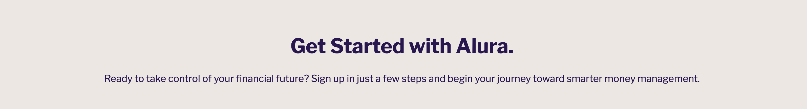

# alura

Alura is a fictional banking website designed as a student project to demonstrate the use of HTML and CSS. It targets busy and professional women, offering a simplified banking experience with tailored investment options. The goal is to create a clean, accessible, and informative static website.

## User Experience

- The website features a clear and professional design that builds trust and credibility.  
- Investment services are presented with accessible information to attract new account sign-ups.  
- Customers are provided with useful content that encourages future interactions with the business.  
- Visitors can grow their financial and investment knowledge through engaging blog posts.  

## User Stories

- As a busy professional woman, I want to quickly see what Alura offers.  
- As someone new to investing, I want clear, jargon-free investment options.  
- As a time-strapped user, I want a simple and fast sign-up form.  
- As someone looking for support, I want to know that EmpowerBank provides educational tools.  
- As a first-time visitor, I want the website to feel trustworthy and professional.  
- As someone who is careful with their money, I want to know I can get in contact with my bank if I have any questions or issues.  
- As a prospective customer, I want to read testimonials and reviews from other customers to feel more confident about signing up for an account with Alura.  
- As a regular tech user, I have high expectations for the website’s user experience and journey.  

## Color Scheme

The color palette consists of two tones of purple (`#18174F` and `#DAD0F1`), a blue hover color (`#64748B`), and a charcoal color (`#2E2E2E`) for the main text. These colors were chosen to reflect themes of power and wealth while also conveying trust and credibility with a feminine touch.

## Typography

The primary font for the site is **Cambay**, with *Sans Serif* as a fallback. **Libre Franklin** is used for headings, selected for its compatibility with Cambay according to Google Fonts. The logo uses the **Arya** font, with *Sans Serif* again as a fallback.

## Wireframes

[Balsamiq](https://balsamiq.com/) was used to create the wireframes for the website, helping visualize the layout and structure of each page and element placement.

Page | Desktop Version | Tablet Version | Mobile Version
--- | --- | --- | ---
Index |  |  | 
Invest |  |  | 
Sign Up |  |  | 

## Features

### General

* Responsive design across all device sizes.

* Similar color scheme and design throughout all pages to effectively structure, categorise and present the information to the customers.

* **Header**

* The header contains the business logo, plus a fully responsive navigation bar positioned at the top of the screen.

* The logo links to the home page 

* The navigation bar is identical in all pages and links to all relevant pages of the website. It has a hover effect which changes color to provide feedback to the user. 

* The 'contact' link in the naviation links to the contact information contained in the site footer

* The sign up page is presented as a button to differentiate it from the rest of the navigation menu as an important page in the website and encourage the user to be drawn to it. 

* **Footer**

* The footer includes the logo and links to the business' social media channels. 

* The social media icons have a hover effect to increase user experience. 

* The footer includes the business email and phone number which are clickable links and also have hover effect to improve user experience. 

* The footer includes a google maps iframe of the business address. 

* The footer also has a table with an unordered list of the business opening hours. There is also a hover effect on the table rows to give the user feedback. 

### Home Page

* **Hero section**

- The hero section is designed to attract the users attention and efficiently describe what the benefit of the business is to the customer. There is also a call-to-action to take the customer to the investment packages page.

* **About Alura Section**

- The about section contains a carousel with four cards that contain modern and attractive illustrations above text to describe the features and benefits of the product

- Followed by another call to action that will bring the user to the invest packages page. 

* **Partners Section**

- The partners section contains some logos that show the partners the business has worked with. The logos are clickable links that take you to the partners website in a new tab. There is a hover effect for user experience.

* **Testimonial Section**

- The testimonial section contains cards with an image of customer, some text describing their experience of the business and a card footer with their name and job role. 

* **Blog Section**

- The blog section contains cards showing the feature image, headline and excerpt from blogs, with a button to take you to a blog page in a new tab. 

### Blog Page

* **Blog Header section**

- The blog header shows the blog's title, feature image an introduction to the blog. 

* **Blog Body section**

- Contains the blog text content including large headers to break up the content into bitesize chunks to improve the user experience. 

### Invest Page

* **Header section**

- The header contains a bold message and appealing text to encourage the user to choose one of the business' products.

* **Plans section**

- The plans sections contains three cards with illustrations and an ordered list containing the information about each of the products the business offers, 

- Followed below by a large CTA button which takes the user to the sign up page. 

### Sign Up Page

* **Header section**

- The header contains a bold message and appealing text to encourage the user to fill out the sign up form.

* **Form section**

- The sign up form contains text fields to enter name and email. Dropdown selection for occupation and monthly income and radio buttons to select the desired investment plan, followed by a submit button with the text 'Apply'. 

- All fields are required in order for the form to be submitted.

- The 'Apply' button is hoverable for feedback to the user. 

- A correctly filled out form will lead the user to the 'success' page. 

### Success Page

* **Success section**

- The success section provides the user with a message so they are clear that their form has been submitted. 

- There is a button for the user to return to the home page if they wish to. 

## Technologies Used

### Languages Used

* [HTML5](https://en.wikipedia.org/wiki/HTML5)
* [CSS3](https://en.wikipedia.org/wiki/CSS)

### Frameworks, Libraries and Programs Used

* [Google Fonts](https://fonts.google.com/)
    - Google Fonts was used to import the fonts Cambay, Libre Franklin and Arya into the style.css file. These fonts were used throughout the site.

* [Font Awesome](https://fontawesome.com/)
     - Font Awesome was used throughout all pages to add icons in order to create a better visual experience for UX purposes.

* [BulkResize](https://bulkresizephotos.com)
    - Bulk Resize was used to reduce the file size of the images for the website.

* [GitHub](https://github.com/)
     - GitHub was used to store the project after pushing.

* [Balsamiq](https://balsamiq.com/)
     - Balsamiq was used to create the wireframes during the design phase of the project.

* [Boostrap](https://getbootstrap.com/)
    - Boostrap was used for grid layouts and components like navbar, cards, carousel, tables, forms and buttons. 

* [ChatGPT](https://chatgpt.com/)
    - ChatGPT was to aid the website copy editing and also for troubleshooting some html and CSS issues I had while building the site. 

* [Blush Design](https://blush.design/)
    - Blush design was used to create illustrations. 

* [Chrome DevTools](https://developer.chrome.com/docs/devtools/)
    - Chrome DevTools was used during development process for code review and to test responsiveness.

* [W3C Markup Validator](https://validator.w3.org/)
    - W3C Markup Validator was used to validate the HTML code.

* [W3C CSS Validator](https://jigsaw.w3.org/css-validator/)
    - W3C CSS Validator was used to validate the CSS code.

## Testing

### Testing User Stories

* As a busy professional woman, I want to quickly see what Alura offers.  
    -  The website offers a intuitive structure for the customers to navigate and find the information they are looking for.

* As someone new to investing, I want clear, jargon-free investment options.  
    - The invest page breaks down each product in comparable tables. 
    - Each invest card contains useful information about the plan. 

* As a time-strapped user, I want a simple and fast sign-up form.  
    - The sign up form is short and simple for the customer to apply for an investment plan. 

* As someone looking for support, I want to know that EmpowerBank provides educational tools.  
    - The blog section contains links to useful articles for the customer to expand their knowledge. 
    - The blog page contains valuable information for the user presented in a digestable manner. 

* As a first-time visitor, I want the website to feel trustworthy and professional.  
    - The website uses professional imagery. 
    - The website uses a strong sense of brand. 
    - The partners and testimonials section give new users more confidence. 

* As someone who is careful with their money, I want to know I can get in contact with my bank if I have any questions or issues.  
    - There is a clear contact link on the navbar that brings the user to the contact section in the footer. 
    - The contact section contains all the information needed for the user to contact the business including clickable links for telephone, email and social media. 

* As a prospective customer, I want to read testimonials and reviews from other customers to feel more confident about signing up for an account with Alura.  
    - The testimonials section give the user more confidence to the use the business' products. 

* As a regular tech user, I have high expectations for the website’s user experience and journey.
    - The website offers a intuitive structure for the customers to navigate.

    - The navigation bar is clearly presented in all pages for the customers to find with ease and it is easily navigable.

### Code Validation

* The [W3C Markup Validator](https://validator.w3.org/) and [W3C CSS Validator](https://jigsaw.w3.org/css-validator/) services were used to validate all pages of the project in order to ensure there were no syntax errors.

    ## Index page
    - W3C Markup Validator found the following errors:
    
    - The alt tags were removed from all <i> elements
    - All syntax errors were corrected
    - All structural errors were corrected

    ## Invest page
    - W3C Markup Validator found the following errors:
    
    - The syntax error was removed

    ## Sign up page
    - W3C Markup Validator found the following errors:
    
    - The option form errors were corrected by adding value="" to disabled dropdown options 
    - All structural errors were corrected
    
    ## Blog page
    - W3C Markup Validator found the following errors:
    
    - All syntax errors were corrected
    - All structural errors were corrected
    
    [No errors](/assets/readme-files/devtest-noerror-html.png)
    - After making the previous corrections the HTML validator showed no further errors on all pages. 

    ## CSS 
    - W3C CSS validator found the following error: 
    
    - This error was corrected by adding correct padding values on the primary-button

    
    - After correcting this error no further errors were shown. 

### Media

* [Raw Pixel](https://www.rawpixel.com/)
    - Graphics for the blogs. 

* [Humaans](https://www.humaaans.com/)
    - Humaans design library was used to source illustrations to be edited in Blush design. 
    - About Alura cards.

* [Undraw](https://undraw.co/)
    - Invest plans illustrations. 

* [Gemini](https://gemini.google.com/)
    - Home page hero image
    - Testimonial images 

* [Logo](https://logo.com)
    - Alura business logo

