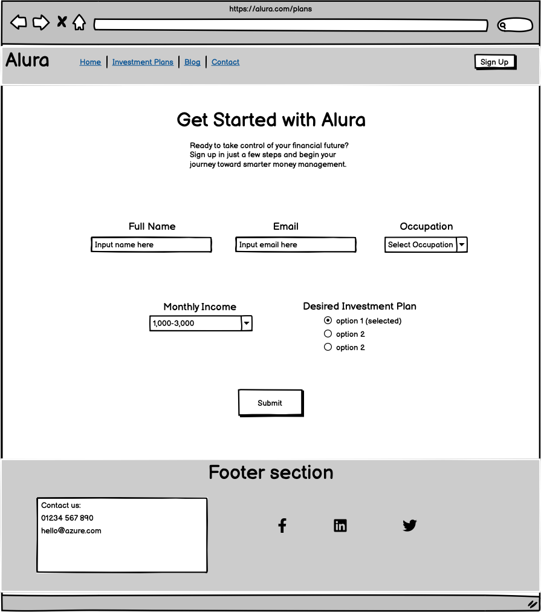

# alura

Alura is a fictional banking website designed as a student project to demonstrate the use of HTML and CSS. It targets busy and professional women, offering a simplified banking experience with tailored investment options. The goal is to create a clean, accessible, and informative static website.

## User Experience

- The website features a clear and professional design that builds trust and credibility.  
- Investment services are presented with accessible information to attract new account sign-ups.  
- Customers are provided with useful content that encourages future interactions with the business.  
- Visitors can grow their financial and investment knowledge through engaging blog posts.  

## User Stories

- As a busy professional woman, I want to quickly see what Alura offers.  
- As someone new to investing, I want clear, jargon-free investment options.  
- As a time-strapped user, I want a simple and fast sign-up form.  
- As someone looking for support, I want to know that EmpowerBank provides educational tools.  
- As a first-time visitor, I want the website to feel trustworthy and professional.  
- As someone who is careful with their money, I want to know I can get in contact with my bank if I have any questions or issues.  
- As a prospective customer, I want to read testimonials and reviews from other customers to feel more confident about signing up for an account with Alura.  
- As a financially-savvy woman, I want offers, money-saving tips, and investment advice sent to my inbox.  
- As a regular tech user, I have high expectations for the website’s user experience and journey.  

## Color Scheme

The color palette consists of two tones of purple (`#18174F` and `#DAD0F1`), a blue hover color (`#64748B`), and a charcoal color (`#2E2E2E`) for the main text. These colors were chosen to reflect themes of power and wealth while also conveying trust and credibility with a feminine touch.

## Typography

The primary font for the site is **Cambay**, with *Sans Serif* as a fallback. **Libre Franklin** is used for headings, selected for its compatibility with Cambay according to Google Fonts. The logo uses the **Arya** font, with *Sans Serif* again as a fallback.

## Wireframes

[Balsamiq](https://balsamiq.com/) was used to create the wireframes for the website, helping visualize the layout and structure of each page and element placement.

Page | Desktop Version | Tablet Version | Mobile Version
--- | --- | --- | ---
Index |  |  | 
Invest |  |  | 
Sign Up |  |  | 

## Features

### General

* Responsive design across all device sizes.

* Similar color scheme and design throughout all pages to effectively structure, categorise and present the information to the customers.

* **Header**

* The header contains the business logo, plus a fully responsive navigation bar positioned at the top of the screen.

* The logo links to the home page 

* The navigation bar is identical in all pages and links to all relevant pages of the website. It has a hover effect which changes color to provide feedback to the user. 

* The 'contact' link in the naviation links to the contact information contained in the site footer

* The sign up page is presented as a button to differentiate it from the rest of the navigation menu as an important page in the website and encourage the user to be drawn to it. 

* **Footer**

* The footer includes the logo and links to the business' social media channels. 

* The social media icons have a hover effect to increase user experience. 

* The footer includes the business email and phone number which are clickable links and also have hover effect to improve user experience. 

* The footer includes a google maps iframe of the business address. 

* The footer also has a table with an unordered list of the business opening hours. There is also a hover effect on the table rows to give the user feedback. 

### Home Page

* **Hero section**

- The hero section is designed to attract the users attention and efficiently describe what the benefit of the business is to the customer. There is also a call-to-action to take the customer to the investment packages page.

* **About Alura Section**

- The about section contains a carousel with four cards that contain modern and attractive illustrations above text to describe the features and benefits of the product

- Followed by another call to action that will bring the user to the invest packages page. 

* **Partners Section**

- The partners section contains some logos that show the partners the business has worked with. The logos are clickable links that take you to the partners website in a new tab. There is a hover effect for user experience.

* **Testimonial Section**

- The testimonial section contains cards with an image of customer, some text describing their experience of the business and a card footer with their name and job role. 

* **Blog Section**

- The blog section contains cards showing the feature image, headline and excerpt from blogs, with a button to take you to a blog page in a new tab. 

### Invest Page

* **Header section**

- The header contains a bold message and appealing text to encourage the user to choose one of the business' products.

* **Plans section**

- The plans sections contains three cards with illustrations and an ordered list containing the information about each of the products the business offers, 

- Followed below by a large CTA button which takes the user to the sign up page. 

### Sign Up Page

* **Header section**

- The header contains a bold message and appealing text to encourage the user to fill out the sign up form.

